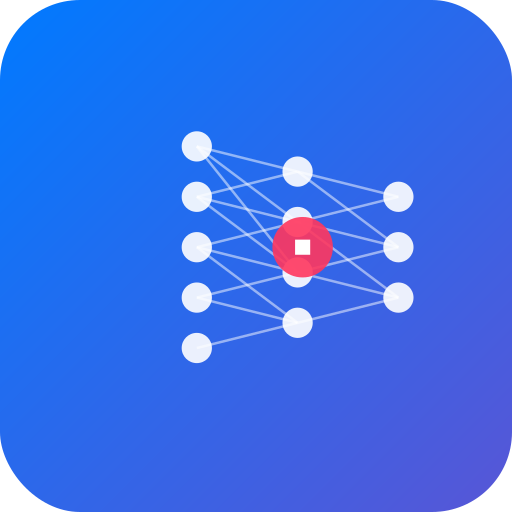

<div align="center">
  
  <h1>AppleNeuralEngine-Kit</h1>
  <p><strong>Run optimized LLMs on Apple Silicon with maximum performance</strong></p>
  <p>
    <a href="https://github.com/antmikinka/AppleNeuralEngine-Kit/blob/main/LICENSE">
      
    </a>
    <a href="https://swift.org">
      
    </a>
    <a href="https://github.com/apple/coremltools">
      
    </a>
  </p>
</div>

## Overview

AppleNeuralEngine-Kit is a comprehensive toolkit for running Large Language Models directly on Apple Silicon using the Neural Engine. It provides optimized conversion, efficient inference, and user-friendly interfaces for working with LLMs on macOS and iOS.

<p align="center">
  
</p>

## ✨ Key Features

- **Architecture-Aware Optimization**: Automatically detects and optimizes models based on architecture (Llama, Qwen, Mistral, etc.)
- **Interactive UI**: Elegant SwiftUI chat interface with conversation history
- **Visual Model Conversion**: Convert models with a user-friendly macOS interface
- **Real-Time Progress Tracking**: Detailed conversion progress with ETA estimates
- **Advanced Memory Management**: Optimized multi-function chunks reduce memory usage by ~50%
- **KV Cache Optimization**: Specialized prefill models for fast token generation
- **Python & Swift Integration**: Seamless integration between conversion and inference
- **Performance Analytics**: Real-time metrics for token generation

## 🚀 Quick Start

### Installation

```bash
# Clone the repository
git clone https://github.com/antmikinka/AppleNeuralEngine-Kit.git
cd AppleNeuralEngine-Kit

# Build the project
swift build

# Install Python dependencies for model conversion (optional)
cd scripts
pip install -r requirements.txt
```

### Running the Chat Interface

```bash
swift run ANEChat
```

### Command Line Usage

```bash
swift run ANEToolCLI --repo-id meta-llama/Llama-3.2-1B --input-text "Tell me about neural networks"
```

### Converting a Model

```bash
# Using the Swift CLI
swift run ANEModelConverter convert-hf --model-id meta-llama/Llama-3.2-1B --output-dir ./models

# Using the Python script with detailed progress
python scripts/convert_hf_to_coreml.py --model_path meta-llama/Llama-3.2-1B --output_path ./models --verbose
```

## 🧠 How It Works

AppleNeuralEngine-Kit uses a sophisticated model conversion process that:

1. **Analyzes Model Architecture**: Detects model type and optimizes accordingly
2. **Splits into Specialized Components**: Separates embeddings, FFN, and LM head
3. **Optimizes for ANE**: Applies architecture-specific optimizations for Apple Neural Engine
4. **Creates Multi-Function Chunks**: Combines components to minimize memory usage
5. **Applies Quantization**: Uses 4-6 bit LUT quantization for optimal size/quality balance

## 📊 Performance

| Model                | Tokens/Sec | Memory Usage | Size  |
|----------------------|------------|--------------|-------|
| Llama-3.2-1B (M1)    | 7.0        | ~1.2 GB      | 600MB |
| Llama-3.2-1B (M3)    | 13.9       | ~1.2 GB      | 600MB |
| Llama-3.2-3B (M3)    | 5.2        | ~3.5 GB      | 1.8GB |

## 📚 Documentation

- [Usage Guide](docs/USAGE.md) - Detailed usage instructions
- [Architecture](docs/ARCHITECTURE.md) - System design overview
- [Model Conversion](docs/MODEL_CONVERSION.md) - Converting models for ANE
- [ANE Model Architecture](docs/ANE_MODEL_ARCHITECTURE.md) - Technical details
- [iOS Implementation](docs/iOS_IMPLEMENTATION_PLAN.md) - iOS deployment
- [Contributing](docs/CONTRIBUTING.md) - Guidelines for contributors
- [Changelog](docs/CHANGELOG.md) - Version history

## 🛠️ Requirements

- macOS 14 (Sonoma) or newer
- Apple Silicon Mac (M1/M2/M3 series)
- Swift 5.9 or newer
- Python 3.8+ with transformers and coremltools (for model conversion)
- Xcode Command Line Tools (for CoreML compilation)

## 🧩 Supported Model Architectures

- **Llama Models** (Llama 2, Llama 3, Llama 3.1, Llama 3.2)
- **Mistral Models** (Mistral 7B, Mistral 8x7B)
- **Qwen Models** (Qwen 1.5, Qwen 2)
- **QwQ Models** (Quantized versions)
- **Phi Models** (Phi-2, Phi-3)
- **Gemma Models** (Gemma 2B, 7B)

## 👥 Contributing

Contributions are welcome! Please read our [Contributing Guidelines](docs/CONTRIBUTING.md) before submitting a pull request.

## 📃 License

This project is licensed under the MIT License - see the [LICENSE](LICENSE) file for details.

## 🙏 Acknowledgements

This project builds upon:
- [CoreML LLM CLI](https://github.com/smpanaro/coreml-llm-cli) by Stephen Panaro
- [ANEMLL](https://github.com/Anemll/Anemll) for ANE-optimized conversion techniques
- [LitGPT](https://github.com/Lightning-AI/lit-gpt) for model optimization techniques
- [Apple Silicon 4-bit quantization](https://github.com/apple/coremltools) for efficient model sizing